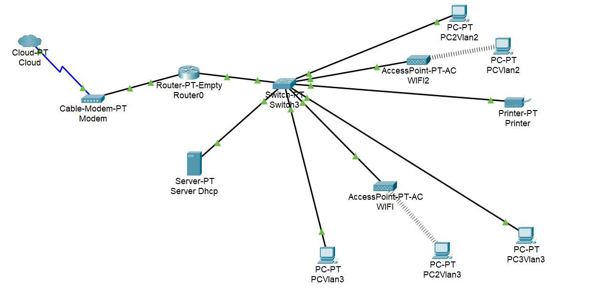
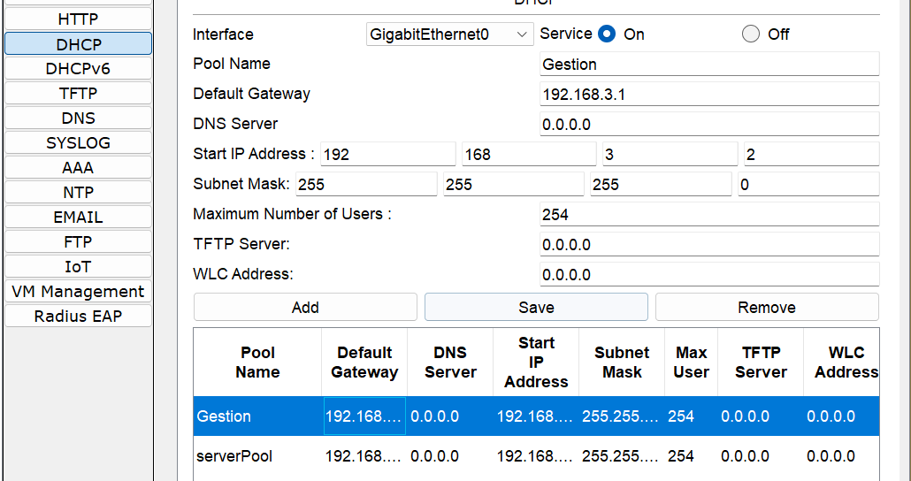
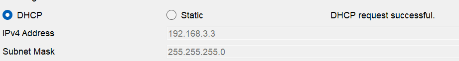
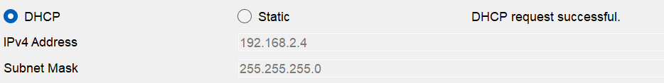
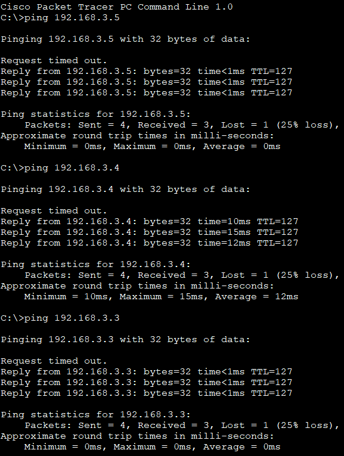
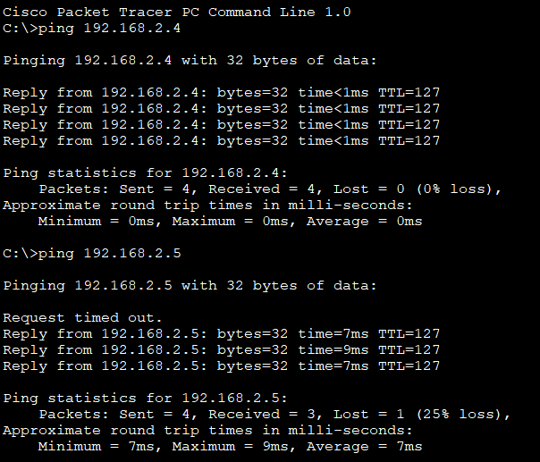
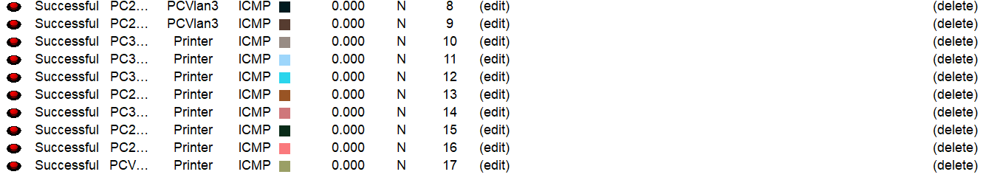

# 🧠 Guide de configuration réseau – Double VLAN

## 1. Objectif du projet
Mettre en place un réseau avec deux VLAN interconnectés, un serveur DHCP, une imprimante et des postes clients filaires et sans fil pour l'entreprise Comptafinance.

---

## 2. Schéma du réseau


---

## 3. Configuration des équipements Cisco

### 🔹 Configuration du routeur
```bash
enable
configure terminal
interface g1/0
ip address 192.168.1.1 255.255.255.0
no shutdown
exit
```
### 🔹Router on stick

```bash
interface g1/0.2
encapsulation dot1Q 2
ip address 192.168.2.1 255.255.255.0
exit

interface g1/0.3
encapsulation dot1Q 3
ip address 192.168.3.1 255.255.255.0

```
### 🔹 Configuration de la switch
~~~bash
Vlan 2
name Accueil
Vlan 3
name Gestion

interface g0/1
switchport mode trunk
switchport trunk Vlan 2,3
no shutdown
exit

interface g4/1
switchport mode access
switchport access Vlan 2
no shutdown
exit

interface g6/1
switchport mode access
switchport access Vlan 2
no shutdown
exit

interface g8/1
switchport mode acess
switchport access Vlan 2
no shutdown
exit
write memory
~~~
## 🔹Configuration Server DHCP

1. *Attribution d'une   adresse ip au server DHCP*
   
        IP Server DHCP = 192.168.2.1 255.255.255.0

2. *Creation d'une pool pour le Vlan 3*



### 🔹 Configuration demande d'IP

```bash
interface g1/0.2
ip helper-address 192.168.2.1
no shutdown
exit

interface g1/0.3
ip helper-address 192.168.2.1
no shutdown
exit
```
###  💻 Test de réussite

:heavy_check_mark: DHCP/IP Vlan 3  



:heavy_check_mark: DHCP/IP Vlan 2 



:heavy_check_mark: Ping interVlan 2↔3






