# Projet Réseau – WAN Simulé

## Documentation Technique

**Auteur :** Garlens Charles  
**Formation :** BTS SIO – Option SISR  
**Année :** 2025  

\newpage

___

## Guide de configuration réseau – WAN Simulé

## 1. Objectif du projet

La PME **NeoEdu** possède deux agences distantes reliées par une liaison WAN simulée. Elle souhaite mettre en place :

- un réseau hautement disponible
- une redondance complète
- des VLANs par département
- une automatisation des sauvegardes
- une supervision avancée (SNMP, Syslog)

L’objectif est d’assurer **sécurité**, **performance**, **diagnostic automatisé**, et de produire une documentation complète.

___

## 2. Schéma du réseau

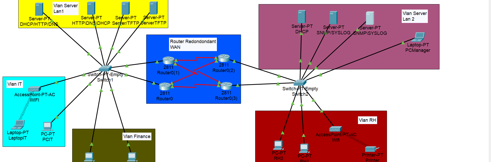
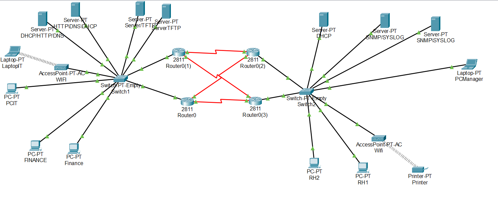

___

## 3. Configuration des équipements Cisco

### 3.1 Attribution des adresses IP des serveurs

    IP Server DHCP = 192.168.80.4 255.255.255.0
    IP Server SNMP/SYSLOG = 192.168.80.5 255.255.255.0
    IP Server SNMP\SYSLOG = 192.168.80.6 255.255.255.0
    IP Server DHCP/HTTP/DNS = 192.168.90.4 255.255.255.0
    IP Server DHCP\HTTP\DNS = 192.168.90.5 255.255.255.0
    IP ServerTFTP = 192.168.90.7 255.255.255.0
    IP Server/TFTP = 192.168.90.6 255.255.255.0

### 3.2 Configuration des switchs

```bash

# Switch 1

vlan 3
name Finance
vlan 4
name IT
vlan 90
name SERVER

interface g0/1
 switchport mode trunk
 switchport trunk allowed vlan 3,4,90
 no shutdown
 exit

interface g2/1
 switchport mode access
 switchport access vlan 4
 no shutdown
 exit

interface g3/1
 switchport mode access
 switchport access vlan 90
 no shutdown
 exit

interface g4/1
 switchport mode access
 switchport access vlan 90
 no shutdown
 exit

interface g5/1
 switchport mode access
 switchport access vlan 90
 no shutdown
 exit

interface g6/1
 switchport mode access
 switchport access vlan 90
 no shutdown
 exit

interface g7/1
 switchport mode access
 switchport access vlan 4
 no shutdown
 exit

interface g8/1
 switchport mode access
 switchport access vlan 3
 no shutdown
 exit

interface g9/1
 switchport mode access
 switchport access vlan 3
 no shutdown
 exit
write memory

# Switch 2

vlan 2
name RH
vlan 80
name Server

interface g0/1
 switchport mode trunk
 switchport trunk allowed vlan 2,80
 no shutdown
 exit

interface g3/1
 switchport mode access
 switchport access vlan 2
 no shutdown
 exit

interface g4/1
 switchport mode access
 switchport access vlan 2
 no shutdown
 exit

interface g9/1
 switchport mode access
 switchport access vlan 2
 no shutdown
 exit

interface g5/1
 switchport mode access
 switchport access vlan 80
 no shutdown
 exit

interface g6/1
 switchport mode access
 switchport access vlan 80
 no shutdown
 exit

interface g7/1
 switchport mode access
 switchport access vlan 80
 no shutdown
 exit

interface g8/1
 switchport mode access
 switchport access vlan 80
 no shutdown
 exit
write memory

```

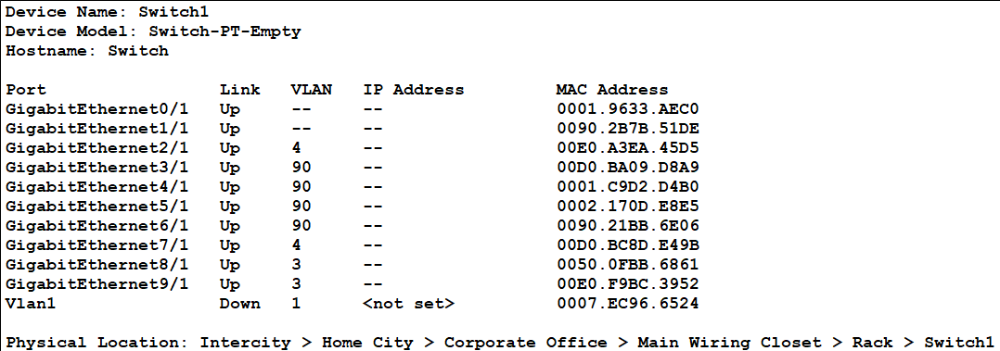
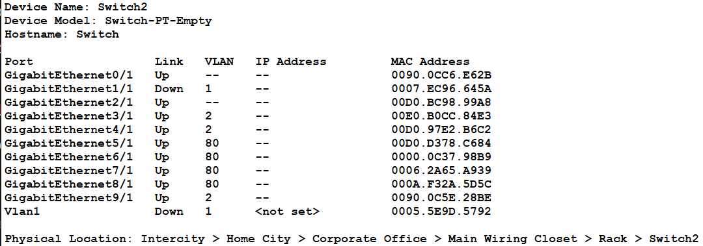

___

### 3.3 Configuration des routers

___

```bash

# Router 1

enable
configure terminal
interface fa0/0
 ip address 192.168.1.2 255.255.255.0
 no shutdown
 exit

# Router on a stick - Vlan Finance


interface fa0/0.3
 encapsulation dot1Q 3
 ip address 192.168.3.2 255.255.255.0
 ip helper-address 192.168.90.5
 ip helper-address 192.168.90.4
 no shutdown
 exit

# Vlan IT

interface fa0/0.4
 encapsulation dot1Q 4
 ip address 192.168.4.2 255.255.255.0
 ip helper-address 192.168.90.5
 ip helper-address 192.168.90.4
 no shutdown
 exit

# Vlan SERVER

interface fa0/0.90
 encapsulation dot1Q 90
 ip address 192.168.90.2 255.255.255.0
 no shutdown
 exit

# Redondance Router 1 Actif

interface fa0/0
 standby 1 ip 192.168.1.1
 standby 1 priority 110
 standby 1 preempt
 no shutdown
 exit

interface fa0/0.3
 standby 1 ip 192.168.3.1
 standby 1 priority 110
 standby 1 preempt
 no shutdown
 exit

interface fa0/0.4
 standby 1 ip 192.168.4.1
 standby 1 priority 110
 standby 1 preempt
 no shutdown
 exit

interface fa0/0.90
 standby 1 ip 192.168.90.1
 standby 1 priority 110
 standby 1 preempt
 no shutdown
 exit

```

___

## 4. Test de réussite

___

___

### 4.1 Relay et attributions IP des serveurs DHCP

___

Avant arrêt d'un des serveurs :

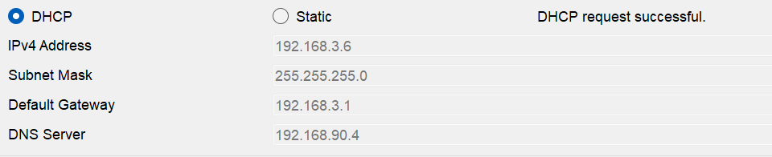

Après la reprise totale des attributions par l'autre serveur :


___

### 4.2 Test et configuration HTTP/DNS

___

1. 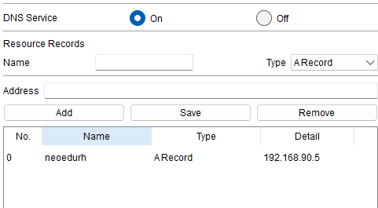
2. 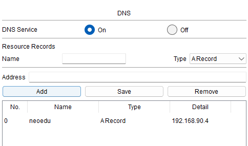
3. 
4. 
5. 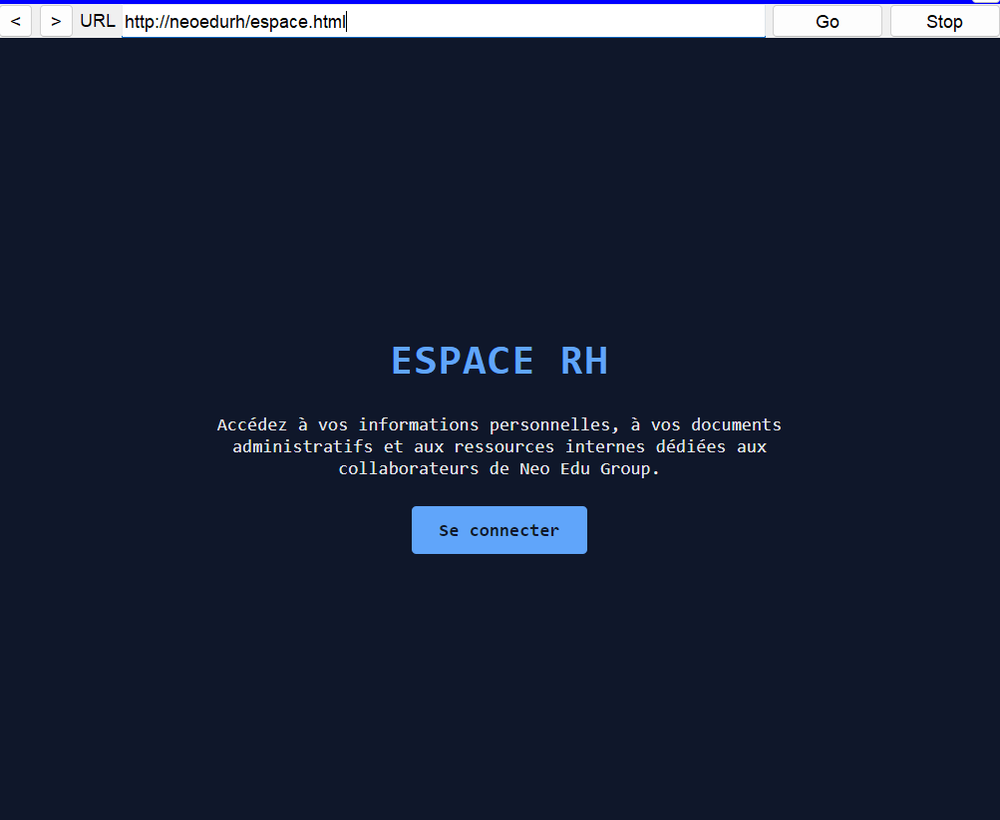

___

### 4.3 Test TFTP

___

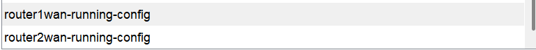

### 4.4 Test SYSLOG et Standby

___

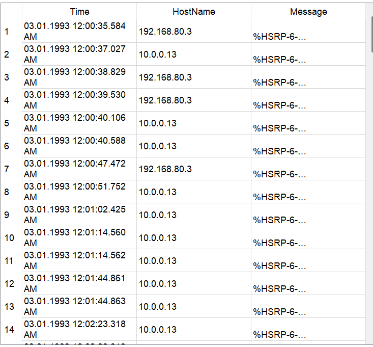


___

### 4.5 Test PING entre VLAN

___

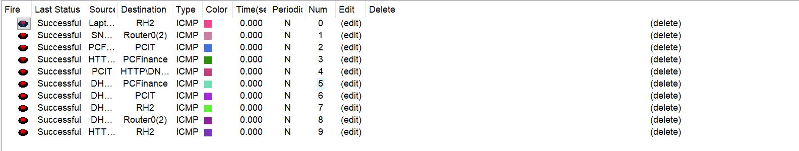
