---
header-includes:
  - \usepackage{graphicx}
  - \setkeys{Gin}{width=\linewidth, keepaspectratio}
  - \usepackage{framed}
  - \usepackage{xcolor}
  - \definecolor{shadecolor}{RGB}{230,230,230}
  - \let\oldverbatim\verbatim
  - \let\endoldverbatim\endverbatim
  - \renewenvironment{verbatim}{\begin{snugshade}\begin{oldverbatim}}{\end{oldverbatim}\end{snugshade}}
  - \usepackage{float}
  - \setkeys{Gin}{width=\linewidth, keepaspectratio}
  - \let\origfigure\figure
  - \let\endorigfigure\endfigure
  - \renewenvironment{figure}[1][]{\origfigure[H]}{\endorigfigure}
---

# Guide de configuration réseau – WAN Simulé
_______
## I/ Objectif du projet
*La PME « NeoEdu » a deux agences distantes reliées par une liaison WAN simulée. Elle souhaite un réseau hautement disponible avec redondance, VLANs par département, automatisation des sauvegardes et supervision avancée (SNMP, syslog). Le rôle est d’assurer sécurité, performance et diagnostic automatisé, et de produire une documentation complète.*


### Schéma du réseau
---


---

## II/ Configuration des équipements Cisco
---
### *Attribution d'une adresse ip aux servers*
   
        IP Server DHCP = 192.168.80.4 255.255.255.0
        IP Server SNMP/SYSLOG = 192.168.80.5 255.255.255.0
        IP Server SNMP\SYSLOG = 192.168.80.6 255.255.255.0
        IP Server DHCP/HTTP/DNS = 192.168.90.4 255.255.255.0
        IP Server DHCP\HTTP\DNS = 192.168.90.5 255.255.255.0 
        IP ServerTFTP = 192.168.90.7 255.255.255.0 
        IP Server/TFTP = 192.168.90.6 255.255.255.0 

###  Configuration des switchs
~~~bash
#Switch 1
Vlan 3
name Finance
Vlan 4
name IT
Vlan 90 
name SERVER

interface g0/1
switchport mode trunk
switchport trunk Vlan 3,4,90
no shutdown
exit

interface g2/1
switchport mode access
switchport access Vlan 4
no shutdown
exit

interface g3/1
switchport mode access
switchport access Vlan 90
no shutdown
exit

interface g4/1
switchport mode access
switchport access Vlan 90
no shutdown
exit

interface g5/1
switchport mode acess
switchport access Vlan 90
no shutdown
exit

interface g6/1
switchport mode access
switchport access Vlan 90
no shutdown
exit

interface g7/1
switchport mode access
switchport access Vlan 4
no shutdown
exit

interface g8/1
switchport mode access
switchport access Vlan 3
no shutdown
exit

interface g9/1
switchport mode access
switchport access Vlan 3
no shutdown
exit
write memory

#Switch 2

Vlan 2
name RH
Vlan 80 
name Server

interface g0/1
switchport mode trunk
switchport trunk Vlan 2,80
no shutdown
exit

interface g3/1
switchport mode access
switchport access Vlan 2
no shutdown
exit

interface g4/1
switchport mode access
switchport access Vlan 2
no shutdown
exit

interface g9/1
switchport mode access
switchport access Vlan 2
no shutdown
exit

interface g5/1
switchport mode access
switchport access Vlan 80
no shutdown
exit

interface g6/1
switchport mode access
switchport access Vlan 80
no shutdown
exit

interface g7/1
switchport mode access
switchport access Vlan 80
no shutdown
exit

interface g8/1
switchport mode access
switchport access Vlan 80
no shutdown
exit
write memory
~~~


### Configuration des Routers 
```bash
# Router 1 

enable
configure terminal
interface fa0/0
ip address 192.168.1.2 255.255.255.0
no shutdown
exit

#Router on stick

#Vlan Finance
interface fa0/0.3
encapsulation dot1Q 3
ip address 192.168.3.2 255.255.255.0
ip helper-address 192.168.90.5
ip helper-address 192.168.90.4
no shutdown
exit
#Vlan IT
interface fa0/0.4
encapsulation dot1Q 4
ip address 192.168.4.2 255.255.255.0
ip helper-address 192.168.90.5
ip helper-address 192.168.90.4
no shutdown
exit
#Vlan SERVER
interface fa0/0.90
encapsulaiton dot1Q 90
ip address 192.168.90.2 255.255.255.0
no shutdown
exit

#Redondance Router 1 Actif

interface fa0/0
standby 1 ip 192.168.1.1
standby 1 priority 110
standby 1 preempt
no shutdown
exit

interface fa0/0.3
standby 1 ip 192.168.3.1
standby 1 priority 110
standby 1 preempt
no shutdown
exit

interface fa0/0.4
standby 1 ip 192.168.4.1
standby 1 priority 110
standby 1 preempt
no shutdown
exit

interface fa0/0.90
standby 1 ip 192.168.90.1
standby 1 priority 110
standby 1 preempt
no shutdown
exit

# Router 2 

enable
configure terminal
interface fa0/0
ip address 192.168.1.3 255.255.255.0
no shutdown
exit

#Router on stick

#Vlan Finance
interface fa0/0.3
encapsulation dot1Q 3
ip address 192.168.3.3 255.255.255.0
ip helper-address 192.168.90.5
ip helper-address 192.168.90.4
no shutdown
exit
#Vlan IT
interface fa0/0.4
encapsulation dot1Q 4
ip address 192.168.4.3 255.255.255.0
ip helper-address 192.168.90.5
ip helper-address 192.168.90.4
no shutdown
exit
#Vlan SERVER
interface fa0/0.90
encapsulaiton dot1Q 90
ip address 192.168.90.3 255.255.255.0
no shutdown
exit

#Redondance Router 2 Standby

interface fa0/0
standby 1 ip 192.168.1.1
standby 1 priority 100
standby 1 preempt
no shutdown
exit

interface fa0/0.3
standby 1 ip 192.168.3.1
standby 1 priority 100
standby 1 preempt
no shutdown
exit

interface fa0/0.4
standby 1 ip 192.168.4.1
standby 1 priority 100
standby 1 preempt
no shutdown
exit

interface fa0/0.90
standby 1 ip 192.168.90.1
standby 1 priority 100
standby 1 preempt
no shutdown
exit

# Router 1 bis 

enable
configure terminal
interface fa0/0
ip address 192.168.10.2 255.255.255.0
no shutdown
exit

#Router on stick

#Vlan RH
interface fa0/0.2
encapsulation dot1Q 2
ip address 192.168.2.2 255.255.255.0
ip helper-address 192.168.90.5
ip helper-address 192.168.80.4
no shutdown
exit

#Vlan Server
interface fa0/0.80
encapsulaiton dot1Q 80
ip address 192.168.80.2 255.255.255.0
no shutdown
exit

#Redondance Router 1bis Actif

interface fa0/0
standby 1 ip 192.168.10.1
standby 1 priority 110
standby 1 preempt
no shutdown
exit

interface fa0/0.2
standby 1 ip 192.168.2.1
standby 1 priority 110
standby 1 preempt
no shutdown
exit

interface fa0/0.80
standby 1 ip 192.168.80.1
standby 1 priority 110
standby 1 preempt
no shutdown
exit

# Router 2 bis 

enable
configure terminal
interface fa0/0
ip address 192.168.10.3 255.255.255.0
no shutdown
exit

#Router on stick

#Vlan RH
interface fa0/0.2
encapsulation dot1Q 2
ip address 192.168.2.3 255.255.255.0
ip helper-address 192.168.90.5
ip helper-address 192.168.80.4
no shutdown
exit

#Vlan Server
interface fa0/0.80
encapsulaiton dot1Q 80
ip address 192.168.80.3 255.255.255.0
no shutdown
exit

#Redondance Router 2bis Standby

interface fa0/0
standby 1 ip 192.168.10.1
standby 1 priority 100
standby 1 preempt
no shutdown
exit

interface fa0/0.2
standby 1 ip 192.168.2.1
standby 1 priority 100
standby 1 preempt
no shutdown
exit

interface fa0/0.80
standby 1 ip 192.168.80.1
standby 1 priority 100
standby 1 preempt
no shutdown
exit
```
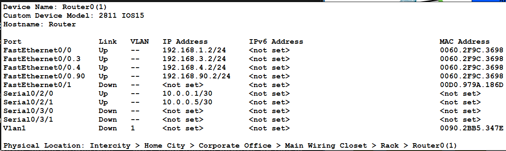
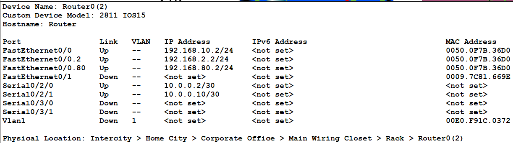
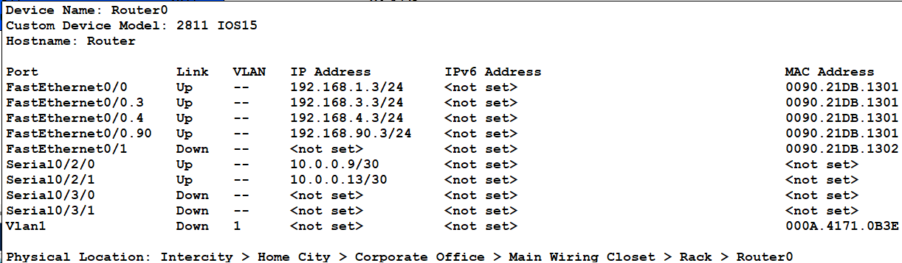
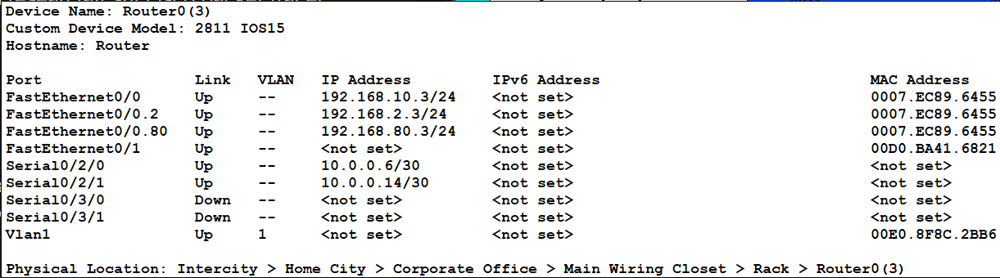

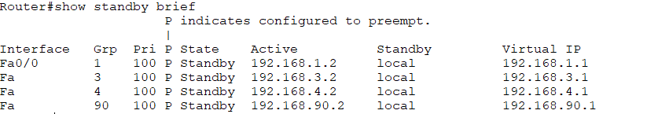


### Configuration Interface Wan

```bash
#Router 1

conf t
interface se0/2/0
ip address 10.0.0.1 255.255.255.252
cloch rate 6400
no shutdown

#Router 1bis

conf t 
interface se0/2/0
ip address 10.0.0.2 255.255.255.252
no shutdown

#Configuration des routes en RIP

#Router 1

conf t
router rip
version 2
no auto-summary
network 192.168.1.0
network 192.168.90.0
network 192.168.3.0
network 192.168.4.0
network 10.0.0.0

#Router 1bis

conf t 
router rip
version 2
no auto-summary
network 192.168.10.0
network 192.168.80.0
network 192.168.2.0
network 10.0.0.0
```
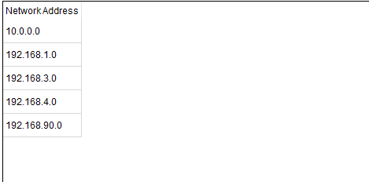
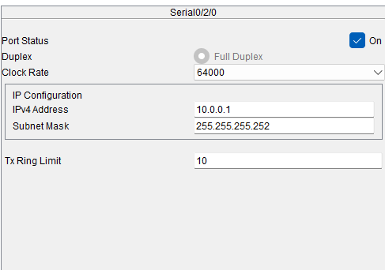

*Les configuration Wan pour les deux autres routers Standby n'ont pas pu être abouti par manque de performance de la part de cisco packet tracer, donc shematiquement les routers seront en redondance Wan mais ne pourront pas vraiment l'être dans la pratique*


### Configurations DHCP/DNS/HTTP

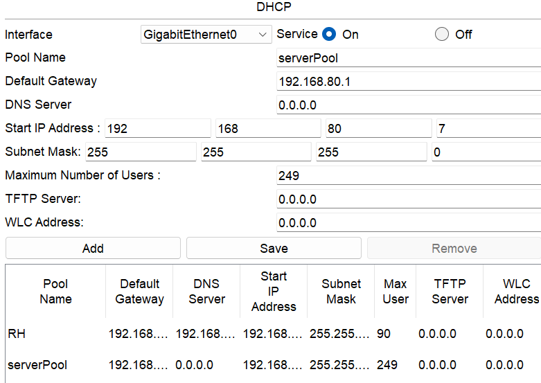
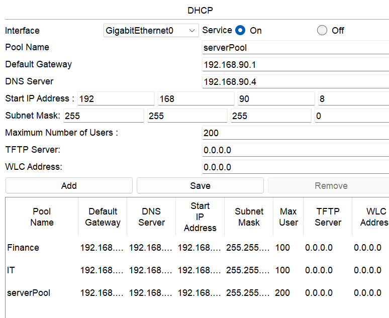
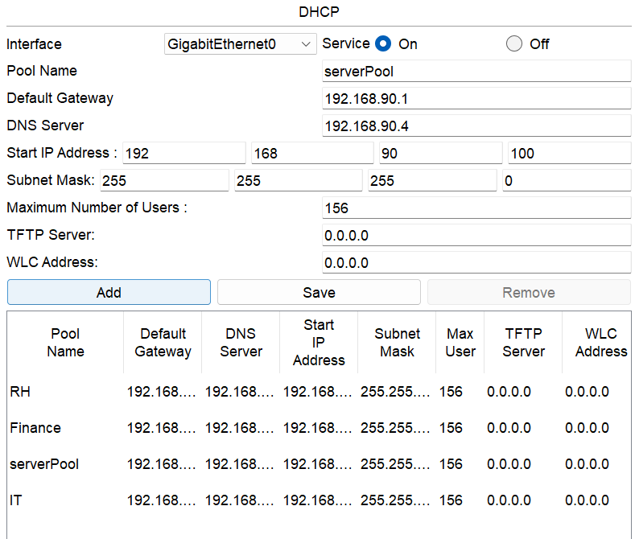

### Configuration SNMP/SYSLOG

*Vu que Cisco Packet Tracer reste limité je ne vais pa spouvoir limité l'acces au SNMP et avoir un agent SNMP comme je l'aurai eu en vrai pareil pour le syslog qui aura des fonctionnalités réduites*

```bash
#Ligne de commande pour la configuration SNMP
conf t 
snmp-server community CHARLES RO
snmp-server community DINO RW
snmp-server host 192.168.80.5
snmp-server host 192.168.80.6
snmp-server enable traps
end
```

*Ici DINO est le mot de passe pour les utilisateurs privés permettant d'avoir les droit de modification des appareils que le server SNMP gere et CHARLES est le mot de passe pour les utilisateurs publics n'ayant pas cette autorisation.*

```bash

#Ligne de commande pour la configuration Syslog
conf t
logging host 192.168.80.5
logging host 192.168.80.6
logging trap informational
service timestamps log datetime msec localtime
exit


```

### Configuration TFTP

```bash
#Cisco limite l'automatisation des envoie des configuration aux servers TFTP.

enable
copy running-config tftp
#L'appareil demande l'IP du server:
192.168.90.6 192.168.90.7
#On nomme le dossier puis l'appareil enverra sa configuration au server
```
---
## III/ Test de réussite
---
___
**Relay et attributions IP des servers DHCP**
___
Avant arret d'un des server :


Apres la reprise totale des attributions par l'autre server : 

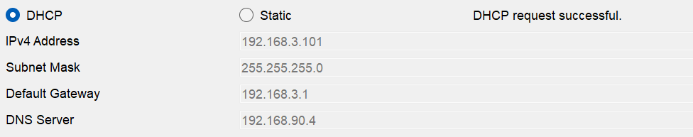
___
**Test et configuration HTTP/DNS**
___

1. 
   
2. 
   
3. 
   
4. 
   
5. 
___
**Test TFTP**
___


**Test SYSLOG et Standby**
___


____
**Test PING entre Vlan**
____


