# 🧠 Guide de configuration réseau – Double VLAN

### 1. Objectif du projet
*Mettre en place le réseau des trois nouveaux département de l'entreprise StratAdvise avec trois VLAN, deux serveur DHCP qui se relaient, un server SNMP et son ordinateur de supervision, un server HTTP/DNS pour les site web de l'entreprise, une imprimante et des postes clients filaires et sans fil pour l'entreprise StratAdvise.*

---

### 2. Schéma du réseau
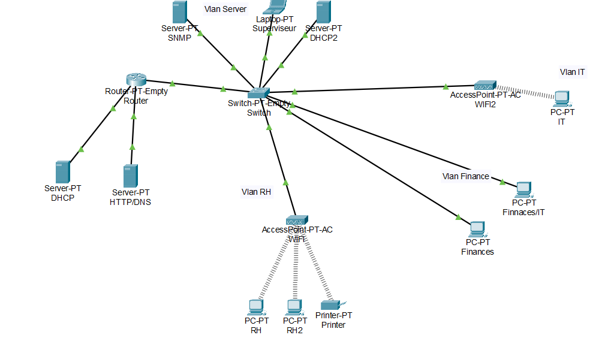

---

## 3. Configuration des équipements Cisco

### 🔹 Configuration des ports Router pour DHCP1 | HTTP/DNS
```bash
enable
configure terminal
# DHCP1
interface g1/0
ip address 192.168.1.1 255.255.255.0
no shutdown
# HTTP/DNS
interface g2/0
ip address 192.168.5.1 255.255.255.0
no shutdown
exit
```
### 🔹 Configuration de la switch
~~~bash
Vlan 2
name RH
Vlan 3
name Finance
Vlan 4 
name IT
Vlan 10
name Server

interface g0/1
switchport mode trunk
switchport trunk Vlan 2,3,4,10
no shutdown
exit

interface g2/1
switchport mode access
switchport access Vlan 2
no shutdown
exit

interface g4/1
switchport mode access
switchport access Vlan 3
no shutdown
exit

interface g5/1
switchport mode access
switchport access Vlan 3
no shutdown
exit

interface g3/1
switchport mode acess
switchport access Vlan 4
no shutdown
exit

interface g1/1
switchport mode access
switchport access Vlan 10
no shutdown
exit

interface g6/1
switchport mode access
switchport access Vlan 10
no shutdown
exit
write memory
~~~
### 🔹Router on stick

```bash
#Vlan RH
interface g0/0.2
encapsulation dot1Q 2
ip address 192.168.2.1 255.255.255.0
exit
#Vlan Finance
interface g0/0.3
encapsulation dot1Q 3
ip address 192.168.3.1 255.255.255.0
#Vlan IT
interface g0/0.4
encapsulaiton dot1Q 4
ip address 192.168.4.1 255.255.255.0
no shutdown
#Vlan Server
interface g0/0.10
encapsulaiton dot1Q 10
ip address 192.168.10.1 255.255.255.0
no shutdown
```
### 🔹Configuration Server DHCP1 | DHCP2 | HTTP/DNS | SNMP

1. *Attribution d'une   adresse ip aux servers*
   
        IP Server DHCP1 = 192.168.1.2 255.255.255.0
        IP Server DHCP2 = 192.168.10.2 255.255.255.0
        IP Server SNMP = 192.168.10.3 255.255.255.0
        IP Server HTTP/DNS = 192.168.5.2 255.255.255.0
        


2. *Creation des pools pour les Vlan utilisateurs*

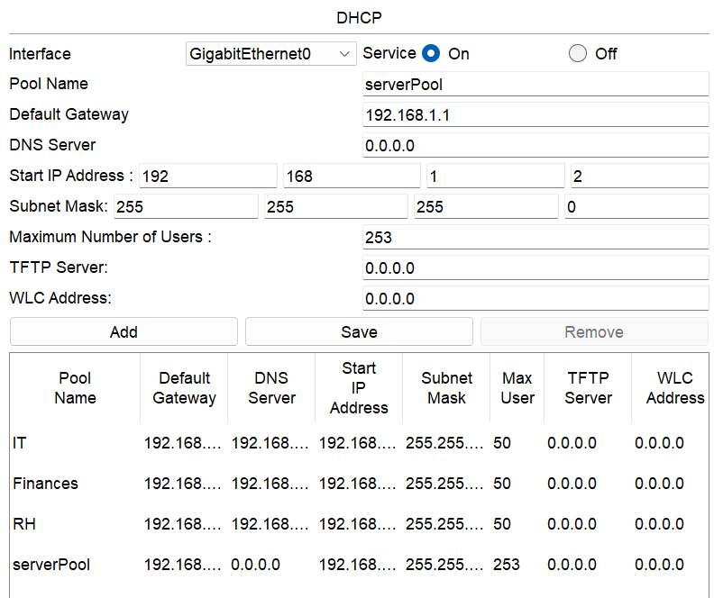
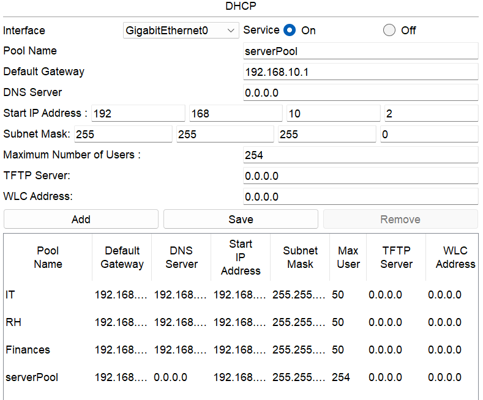

### 🔹 Configuration demande d'IP

```bash
interface g1/0.2
ip helper-address 192.168.1.2
ip helper-address 192.168.10.2
no shutdown
exit

interface g1/0.3
ip helper-address 192.168.1.2
ip helper-address 192.168.10.2
no shutdown

interface g1/0.4
ip helper-address 192.168.1.2
ip helper-address 192.168.10.2
no shutdown
exit
exit
```
### 🔹 Configuration ACL

*Je configure l'ACL de tel sorte à ce que, tous les USER de chaques VLan ne puissent pas avoir accès aux autres depuis leur Vlan mais qu'ils puissent quand même recevoir leur IP du server DHCP dans le vlan SERVER*

```bash
conf t
ip access-list extended INTER_VLAN_BLOCK
 deny ip 192.168.4.0 0.0.0.255 192.168.2.0 0.0.0.255
 deny ip 192.168.4.0 0.0.0.255 192.168.3.0 0.0.0.255
 deny ip 192.168.2.0 0.0.0.255 192.168.4.0 0.0.0.255
 deny ip 192.168.2.0 0.0.0.255 192.168.3.0 0.0.0.255
 deny ip 192.168.3.0 0.0.0.255 192.168.4.0 0.0.0.255
 deny ip 192.168.3.0 0.0.0.255 192.168.2.0 0.0.0.255
 permit ip 192.168.4.0 0.0.0.255 192.168.10.0 0.0.0.255
 permit ip 192.168.2.0 0.0.0.255 192.168.10.0 0.0.0.255
 permit ip 192.168.3.0 0.0.0.255 192.168.10.0 0.0.0.255
 permit ip any any
 exit

 interface g0/0.2
 ip access-group INTER_VLAN_BLOCK out
 interface g0/0.3
 ip access-group INTER_VLAN_BLOCK out
 interface g0/0.4
 ip access-group INTER_VLAN_BLOCK out
 interface g0/0.10
 ip access-group INTER_VLAN_BLOCK out
 exit
 ```
 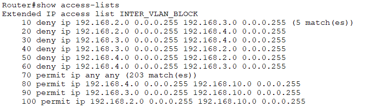
### 🔹 Configuration SNMP

*Vu que Cisco Packet Tracer reste limité je ne vais pa spouvoir limité l'acces au SNMP et avoir un agent SNMP comme je l'aurai eu en vrai*

```bash
conf t 
snmp-server community DINO RW
exit
```
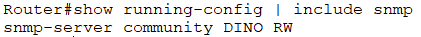
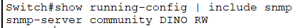
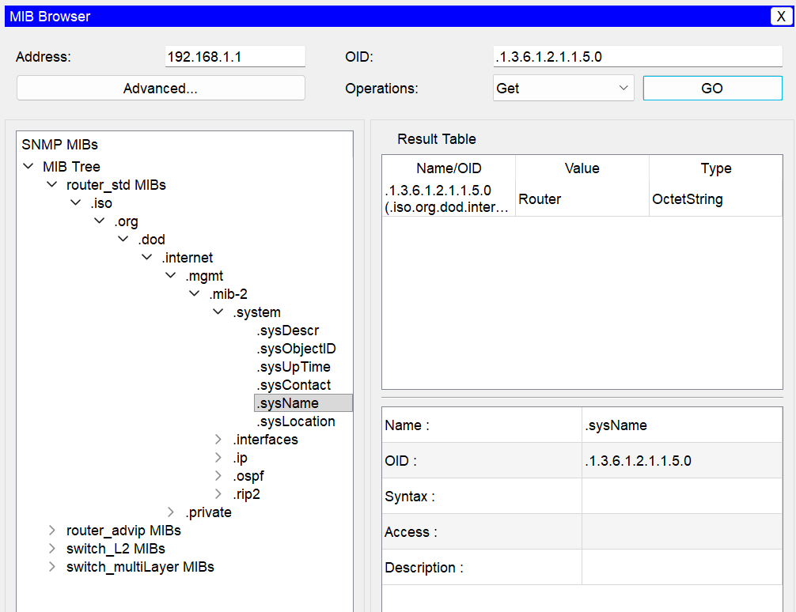
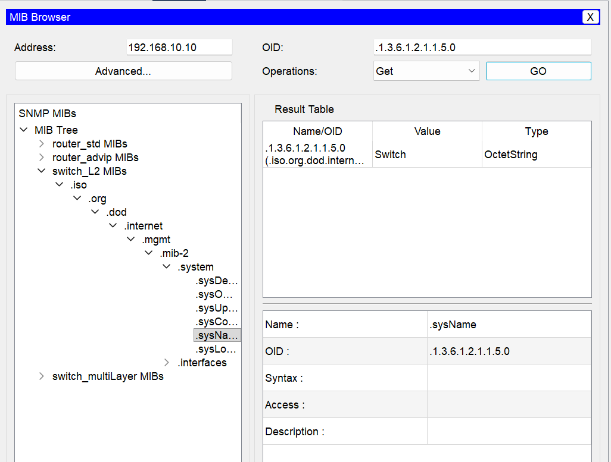


##  💻 Test de réussite
___
**Attribution d'IP par les servers DHCP**
___

 DHCP/IP Vlan 3  
 DHCP/IP Vlan 2 
 DHCP/IP Vlan 4 
___
**Relay des servers DHCP**
___
Avant arret d'un des server :
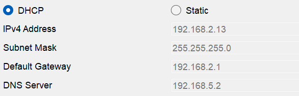
Apres la reprise totale des attributions par l'autre server : 

___
**Test et configuration HTTP/DNS**
___
1. 
2. 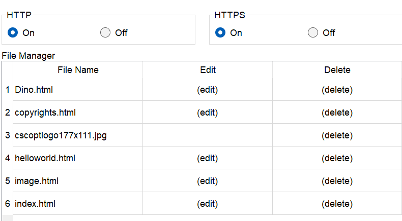
4. 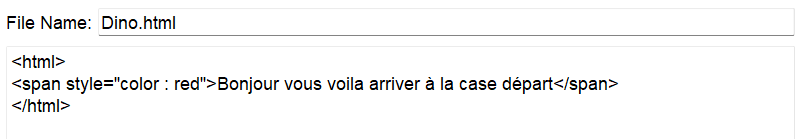
5. 
6. 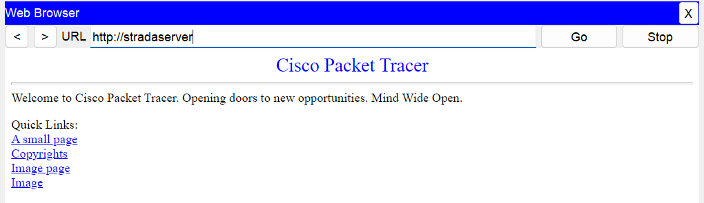
___
**Test SNMP**

Router


Switch

____
**Configuration Router et Switch**
____

Router
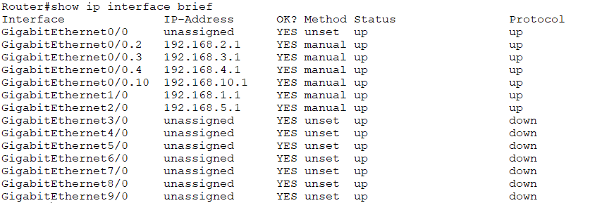
Switch
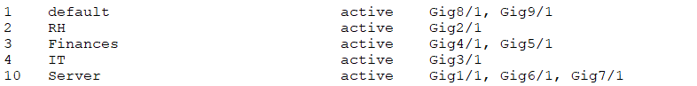
____
**Test PING entre Vlan**
____

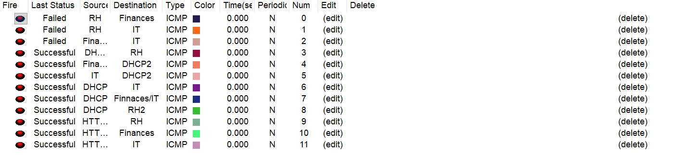